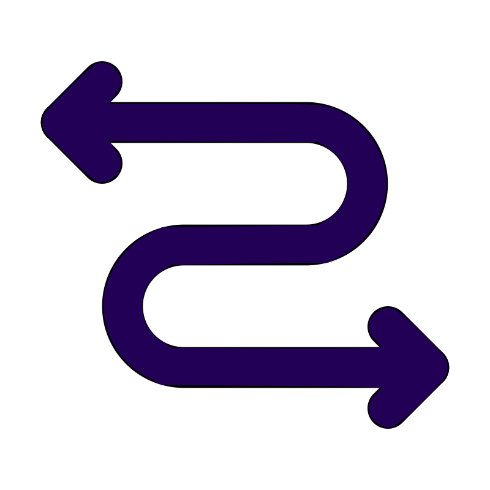

  <picture>
    
  </picture>
 

<h2>Ordered</h2>

A collection of data structures that keep data in order in pure Zig

---

Ordered is a Zig library that provides fast and efficient implementations of various popular data structures including
B-tree, skip list, trie, and red-black tree for Zig programming language.

### Supported Data Structures

Currently supported data structures include:

- [B-tree](src/ordered/btree_map.zig): A self-balancing search tree where nodes can have many children.
- [Sorted Set](src/ordered/sorted_set.zig): A data structure that stores a collection of unique elements in a consistently sorted order.
- [Skip List](src/ordered/skip_list.zig): A probabilistic data structure that uses multiple linked lists to create "express lanes" for fast, tree-like search.
- [Trie](src/ordered/trie.zig): A tree where paths from the root represent prefixes which makes it extremely fast for tasks like text autocomplete.
- [Red-black Tree](src/ordered/red_black_tree.zig): A self-balancing binary search tree that uses node colors to guarantee efficient operations.
- [Cartesian Tree](src/ordered/cartesian_tree.zig): A binary tree that uniquely combines a binary search tree property for its keys with a heap** property for its values.

| # | Data Structure | Build Complexity | Memory Complexity | Search Complexity    |  
|---|----------------|------------------|-------------------|----------------------|
| 1 | B-tree         | $O(\log n)$      | $O(n)$            | $O(\log n)$          |  
| 2 | Cartesian tree | $O(\log n)$\*    | $O(n)$            | $O(\log n)$\* |  
| 3 | Red-black tree | $O(\log n)$      | $O(n)$            | $O(\log n)$          |  
| 4 | Skip list      | $O(\log n)$\*    | $O(n)$            | $O(\log n)$\* |  
| 5 | Sorted set     | $O(n)$           | $O(n)$            | $O(\log n)$          |
| 6 | Trie           | $O(m)$           | $O(n \cdot m)$    | $O(m)$               |  

- $n$: number of stored elements
- $m$: maximum length of a key
- \*: average case complexity

> [!IMPORTANT]
> Ordered is in early development, so bugs and breaking API changes are expected.
> Please use the [issues page](https://github.com/CogitatorTech/ordered/issues) to report bugs or request features.

---

### Getting Started

To be added.

---

### Documentation

You can find the API documentation for the latest release of Ordered [here](https://CogitatorTech.github.io/ordered/).

Alternatively, you can use the `make docs` command to generate the documentation for the current version of Ordered.
This will generate HTML documentation in the `docs/api` directory, which you can serve locally with `make serve-docs`
and view in a web browser.

### Examples

Check out the [examples](examples) directory for example usages of Ordered.

---

### Contributing

See [CONTRIBUTING.md](CONTRIBUTING.md) for details on how to make a contribution.

### License

Ordered is licensed under the MIT License (see [LICENSE](LICENSE)).

### Acknowledgements

* The logo is from [SVG Repo](https://www.svgrepo.com/svg/469537/zig-zag-left-right-arrow) with some modifications.
